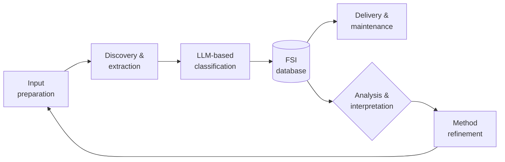
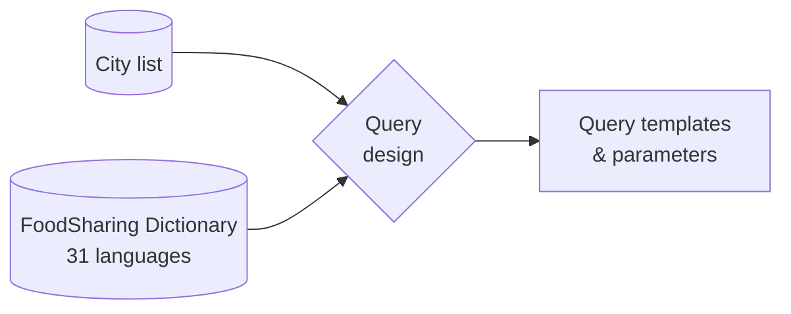
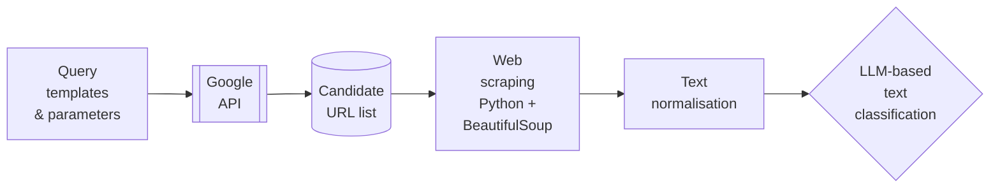
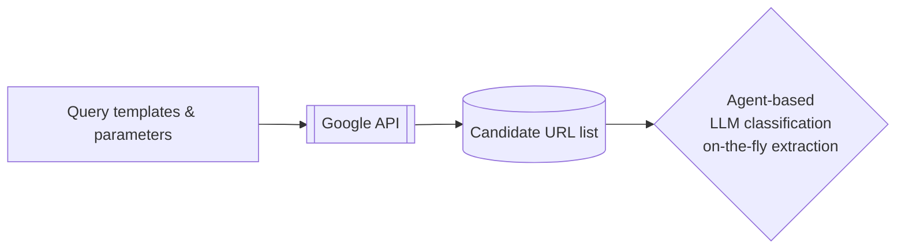
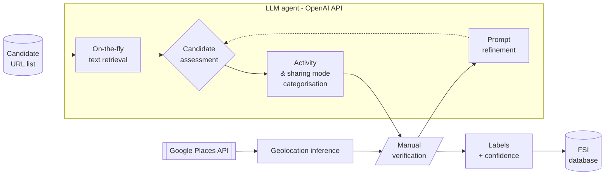
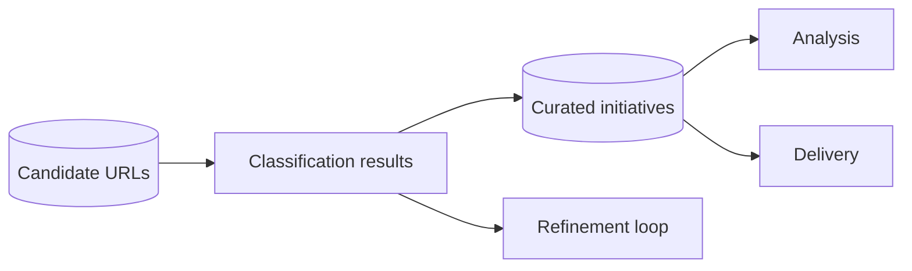
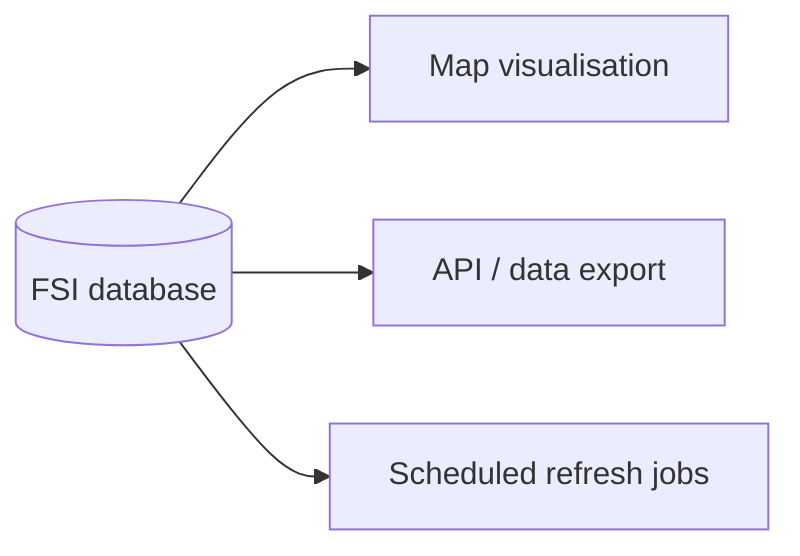
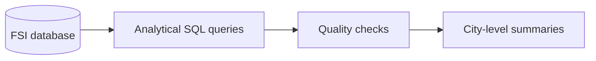
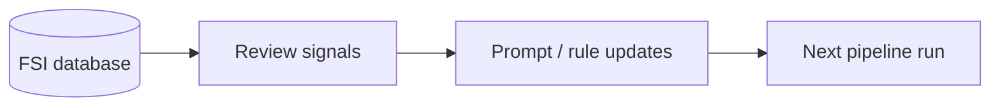

# System architecture — Food Sharing Map pipeline

This document describes the end-to-end architecture of the Food Sharing Map automation pipeline, with a focus on data flow, persistence, and reuse.
The system is designed to support large-scale, iterative execution with incremental updates and minimal redundant processing.

## My role

As Data Solution Architect and Systems Design Lead for Sharing Solutions, I led the collaborative design and review of the end-to-end system architecture across the WP2 team.

## Pipeline overview (upstream)

## Input preparation

Defines what gets searched by producing consistent query inputs across cities and languages.

**Inputs**: city list, multilingual keyword sets  
**Approach**: rule-based query templates informed by domain knowledge  
**Output**: structured query inputs for discovery

## Discovery & extraction

Generates a candidate URL set per city from search results, ready for classification.

**Architecture option 1: crawl-and-store pipeline**

**Architecture option 2: agent-based on-the-fly classification**

- Current implementation adopts the agent-based on-the-fly architecture, reducing the need for persistent storage of large-scale full-text corpora.

## LLM-based classification

Turns candidate URLs into labelled records (valid/invalid + type), with manual review used to improve decision rules over time.

**Inputs**: Normalised text content, source URL, city context, and query metadata  
**Approach**: Prompt-based LLM classification informed by domain-specific criteria  
**Outputs**: Binary and categorical labels indicating relevance and initiative type. Manual verification feeds back into prompt and rule updates

## FSI database

Persists classification outcomes and curated initiatives, enabling incremental re-runs (skip already-seen URLs) and powering analysis and delivery.

### Conceptual data model (summary)

The FSI database is organised around a small number of core entities with clear, intentional relationships.
This structure supports incremental operation, traceability, and separation between discovery and curation. See [schema/ERD.dbml](schema/ERD.dbml) for the full ERD.

| Column                  | Type              | Description                             |
| ----------------------- | ----------------- | --------------------------------------- |
| initiative_id           | STRING            | Stable internal identifier              |
| name                    | STRING            | Curated initiative name                 |
| country                 | STRING            | Country where the initiative operates   |
| city                    | STRING            | City where the initiative is located    |
| canonical_url           | STRING            | Canonical website or primary source URL |
| instagram_url           | STRING (nullable) | Instagram page (if available)           |
| twitter_url             | STRING (nullable) | Twitter / X page (if available)         |
| facebook_url            | STRING (nullable) | Facebook page (if available)            |
| food_sharing_activities | STRING            | Activity labels (multi-value)           |
| how_it_is_shared        | STRING            | Sharing modality / mode                 |
| lon                     | FLOAT (nullable)  | Longitude (WGS84)                       |
| lat                     | FLOAT (nullable)  | Latitude (WGS84)                        |
| comments                | STRING (nullable) | Manual notes and contextual remarks     |
| date_checked            | DATE (nullable)   | Latest manual verification date         |
| date_modified           | DATE (nullable)   | Last curation update date               |

## Delivery

Consumes curated initiative records from the FSI database to power external outputs and scheduled updates.

- Operates on curated, stable records
- No dependency on raw web content

## Analysis

Runs analytical and quality-check queries on curated initiatives and classification outcomes.

- Aggregate metrics and coverage assessment
- Supports monitoring and validation across runs

## Method refinement

Uses stored classification outcomes and manual review signals to adjust classification prompts and rules in subsequent runs.

- No reprocessing unless explicitly triggered
- Focused on incremental improvement, not re-labelling from scratch
