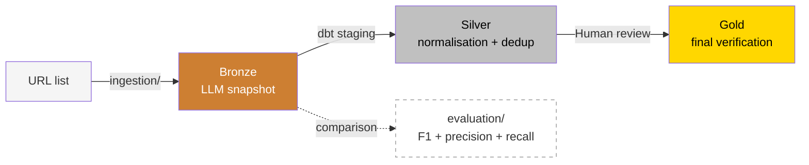

# CULTIVATE - Analytics Platform for 105 European Cities

End-to-end data pipeline for discovering, classifying, and curating
food sharing initiatives across 105 European cities using LLM-based
classification, dbt transformation, and structured human-in-the-loop
verification.

## Architecture




## Pipeline Overview

| Layer | Directory | What it does | Deterministic? |
|-------|-----------|-------------|----------------|
| Landing | `ingestion/` | URL -> LLM agent -> classification snapshot | No (non-deterministic) |
| Bronze | `dbt/models/staging/` | LLM result snapshots as source | Immutable snapshot |
| Silver | `dbt/models/intermediate/` | Normalisation, entity resolution, dedup | Yes (`dbt run` reproducible) |
| Gold | `dbt/models/marts/` | Human-reviewed, decision-ready | Yes |
| Evaluation | `evaluation/` | F1, precision/recall tracking | N/A (monitoring) |

### Rebuilt Medallion Lineage (current)

- Bronze source snapshot: `CULTIVATE.HC_LOAD_DATA_FROM_CLOUD.SILVER_FSI_201225`
- Silver normalization: `dbt/models/staging/stg_fsi_powerbi_export.sql`
- Gold reconstruction: `dbt/models/marts/gold_fsi_final_rebuilt.sql` (deterministic dedup)
- Downstream marts: models in `dbt/models/marts/` reading from `ref('gold_fsi_final_rebuilt')`

## Quick Start

```bash
# 1. Set up environment
cp .env.example .env  # fill in your credentials

# 2. Run ingestion prototype (prints classifications only)
python scripts/run_ingestion.py

# 3. Load Snowflake raw/gold tables (requires configured Snowflake + stage)
python scripts/run_snowflake_load.py

# 3a. (Optional) Load run-01 tracker XLSX into raw_sharecity200_tracker_run01
python scripts/load_sharecity200_tracker_run01.py --xlsx /path/to/ShareCity200Tracker.xlsx

# 4. Run dbt transformations
bash scripts/run_dbt.sh

# 5. Run evaluation against reference set
python scripts/run_evaluation.py
```

## Key Results

- **3,052** validated food sharing initiatives across 105 cities
  (Validated = human-reviewed inclusion criteria; see `ARCHITECTURE.md`)
- **200,000+** candidate URLs processed per iteration
  (1 iteration = full pipeline run across all 105 cities)
- Classification accuracy: 32.0% -> 68.9% -> 74.5% across 3 major versions
  (measured on fixed reference set of 228 URLs; see `evaluation/README.md`)

## References

- Wu, H., Cho, H. et al. (2024), ACM CIKM, DOI: [10.1145/3627673.3680090](https://doi.org/10.1145/3627673.3680090)
- Potyagalova, A., Cho, H., Bacher, I., Wu, H., Buffini, P., Davies, A. R., Jones, G. J. F. (2026), ACM WSDM, DOI: [10.1145/3773966.3779409](https://doi.org/10.1145/3773966.3779409)

## Stack

Snowflake | dbt | Python | Azure (Data Factory, SQL) | LLM/OpenAI API | GitHub Actions

## GitHub

- [github.com/HCHODUBLIN/CULTIVATE](https://github.com/HCHODUBLIN/CULTIVATE)
