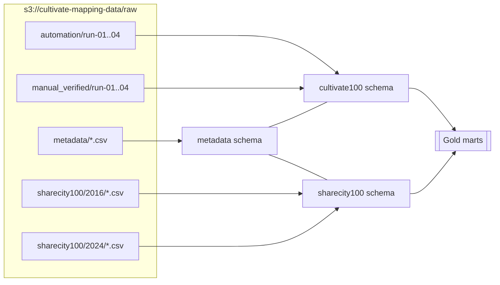
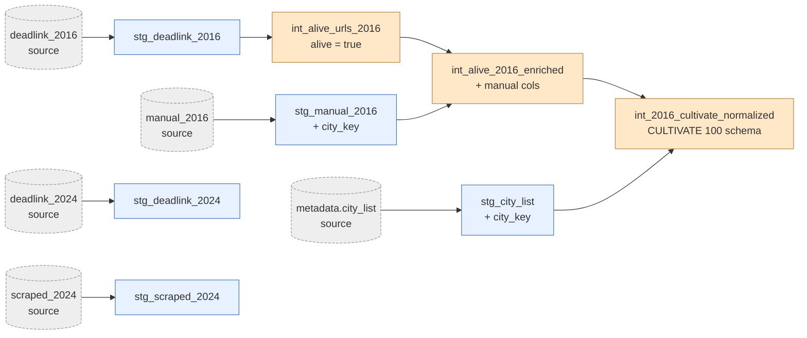

# dbt — Deterministic Medallion Transformations

SQL transformations over three datasets: **metadata** (shared lookups),
**cultivate100** (production FSI mapping), **sharecity100** (2016 + 2024
re-validation). All models read from S3 via dbt-duckdb `httpfs`; the
DuckDB file is a local cache and is not committed.

## Run

```bash
cd dbt
dbt deps
dbt build        # run + test; or: dbt run / dbt test
```

A single schema per domain lives in the DuckDB database:

| Schema | Models |
|---|---|
| `metadata` | `stg_city_list` |
| `cultivate100` | `stg_automation_run01..04`, `stg_verified_run01..04` |
| `sharecity100` | `stg_manual_2016`, `stg_deadlink_{2016,2024}`, `stg_scraped_2024`, `int_alive_urls_2016`, `int_alive_2016_enriched`, `int_2016_cultivate_normalized` |

## Project layout

```
dbt/
├── dbt_project.yml
├── macros/
│   └── normalize_city.sql          -- accent/punctuation-agnostic city key
└── models/
    ├── sources.yml                 -- all S3-backed sources
    ├── metadata/                   -- cross-dataset reference tables
    ├── cultivate100/               -- production FSI mapping
    │   ├── staging/
    │   ├── intermediate/
    │   └── marts/
    └── sharecity100/               -- 2016 + 2024 re-validation pipeline
        ├── staging/
        ├── intermediate/
        └── marts/
```

## Pipeline (high level)

Each domain reads its own S3 prefix and keeps work isolated. `metadata`
is shared — it feeds both CULTIVATE 100 and SHARECITY 100 where a
city lookup is needed.



## SHARECITY 100 model lineage

The active work — re-validate 2016 entries against 2024 automation output,
with a final schema aligned to CULTIVATE 100 for cross-dataset analysis.



## Reproducibility

All transforms are deterministic given fixed S3 inputs.
- `macros/normalize_city.sql` provides the single source of truth for
  the city join key (accents, punctuation, state suffix are stripped).
- `dbt build` is the one-shot entry point: models build, tests run,
  and downstream models skip when upstream tests fail.
