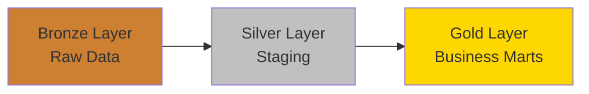

# CULTIVATE Mapping Pipeline - Entity Relationship Diagram

## Data Model Overview

This ERD visualizes the CULTIVATE FSI mapping pipeline using a **Medallion Architecture**: Bronze → Silver → Gold.

### Visualization Options

1. **Interactive ERD (Recommended)**: Copy the contents of [`ERD.dbml`](./ERD.dbml) and paste into [https://dbdiagram.io](https://dbdiagram.io) for an interactive, editable ERD with full relationships.

2. **Mermaid Diagram**: View the simplified ERD below (renders in GitHub, VSCode, and other Markdown viewers).

---

## Medallion Architecture



### Bronze Layer
- **raw_automation**: URLs discovered by automation (5 rounds)
- **raw_automation_reviewed**: Manual review decisions
- **raw_ground_truth**: Manually collected URLs for validation
- **raw_city_language**: Language mapping for multi-lingual search
- **raw_manual_verification**: Manual verification results (105 cities, 5 rounds)
- **bronze_sharecity200_raw**: Pre-deduplication data (3,140 FSIs)
- **gold_fsi_final**: Post-deduplication Gold data (3,052 FSIs)

### Silver Layer
- **stg_automation**: Cleaned automation URLs
- **stg_automation_enhanced**: URL normalization (MDM)
- **stg_automation_review**: Cleaned review decisions
- **stg_ground_truth**: Cleaned ground truth
- **stg_ground_truth_enhanced**: Ground truth with URL normalization
- **stg_manual_verification**: Cleaned manual verification

### Gold Layer
- **fsi_city_summary**: City-level FSI statistics
- **fsi_cluster_analysis**: Regional cluster aggregation
- **fsi_activity_summary**: Activity breakdown
- **fsi_deduplication_impact**: Pre vs post deduplication comparison
- **accuracy_comparison**: Automation accuracy improvement (32% → 74%)
- **manual_verification_summary**: Aggregated manual verification
- **fp_pattern_analysis**: False positive patterns
- **mart_pipeline_eval**: Pipeline quality metrics
- **mart_mapping_comparison**: Automation vs ground truth

---

## Simplified ERD (Mermaid)

```mermaid
erDiagram
    %% Bronze Layer
    raw_automation ||--o| raw_automation_reviewed : "automation_id"
    raw_automation {
        varchar automation_id PK
        varchar city
        varchar run_id
        varchar source_url
        timestamp loaded_at
    }

    raw_automation_reviewed {
        varchar automation_id PK,FK
        varchar is_included
        timestamp loaded_at
    }

    raw_ground_truth {
        varchar ground_truth_id PK
        varchar city
        varchar source_url
        timestamp loaded_at
    }

    raw_city_language {
        varchar city PK
        varchar search_language
        timestamp loaded_at
    }

    raw_manual_verification {
        varchar city
        varchar url
        boolean is_valid
        varchar fp_category
        varchar round_version
        timestamp loaded_at
    }

    bronze_sharecity200_raw {
        varchar country
        varchar city
        varchar name
        varchar url
        varchar food_sharing_activities
        varchar how_it_is_shared
        float lon
        float lat
        timestamp date_modified
    }

    gold_fsi_final {
        varchar id PK
        varchar name
        varchar url
        varchar country
        varchar city
        varchar food_sharing_activities
        varchar how_it_is_shared
        float lng
        float lat
    }

    %% Silver Layer
    stg_automation ||--|| raw_automation : "automation_id"
    stg_automation_enhanced ||--|| stg_automation : "automation_id"
    stg_automation_review ||--|| stg_automation : "automation_id"

    stg_automation {
        varchar automation_id PK
        varchar city
        varchar source_url
    }

    stg_automation_enhanced {
        varchar automation_id PK
        varchar normalized_url
        varchar domain
    }

    stg_automation_review {
        varchar automation_id PK
        boolean is_included
    }

    stg_ground_truth ||--|| raw_ground_truth : "ground_truth_id"
    stg_ground_truth_enhanced ||--|| stg_ground_truth : "ground_truth_id"

    stg_ground_truth {
        varchar ground_truth_id PK
        varchar city
        varchar source_url
    }

    stg_ground_truth_enhanced {
        varchar ground_truth_id PK
        varchar normalized_url
        varchar domain
    }

    stg_manual_verification ||--o{ raw_manual_verification : "source"
    stg_manual_verification {
        varchar city
        varchar url
        boolean is_valid
        varchar fp_category
        varchar round_version
    }

    %% Gold Layer - FSI Landscape
    fsi_city_summary ||--o{ gold_fsi_final : "city"
    fsi_city_summary {
        varchar city PK
        varchar country
        int fsi_count
        int population_2023
        float fsis_per_100k
        varchar cluster
    }

    fsi_cluster_analysis {
        varchar cluster PK
        int cities_count
        int total_fsis
        float avg_fsis_per_city
        float avg_fsis_per_100k
    }

    fsi_activity_summary {
        varchar activity PK
        int fsi_count
        int total_fsis
        float pct_of_total
    }

    fsi_deduplication_impact ||--o{ gold_fsi_final : "city"
    fsi_deduplication_impact ||--o{ bronze_sharecity200_raw : "city"
    fsi_deduplication_impact {
        varchar city PK
        int fsi_count_before
        int fsi_count_after
        int duplicates_removed
        float dedup_rate_pct
    }

    %% Gold Layer - Pipeline Evaluation
    accuracy_comparison {
        varchar city
        varchar round_version
        int round_number
        float manual_accuracy_pct
        float automation_accuracy_pct
        float accuracy_improvement
    }

    manual_verification_summary ||--o{ stg_manual_verification : "aggregates"
    manual_verification_summary {
        varchar city
        varchar round_version
        int total_urls_checked
        int valid_fsis
        float accuracy_pct
    }

    fp_pattern_analysis ||--o{ stg_manual_verification : "categorizes"
    fp_pattern_analysis {
        varchar fp_category PK
        int total_count
        float pct_of_total
    }

    mart_pipeline_eval {
        varchar city PK
        int true_positives
        int false_positives
        int false_negatives
        float precision
        float recall
        float f1_score
    }
```



---

## Key Features

### 1. URL Normalization as MDM
- **stg_automation_enhanced** and **stg_ground_truth_enhanced** implement URL normalization
- Converts URLs to lowercase, removes www/https for consistent matching
- Extracts domain for deduplication strategy

### 2. Multi-Strategy Deduplication
- **Exact matching**: Normalized country+city+name
- **URL-based**: Normalized URL comparison
- **Fuzzy matching**: 92% similarity threshold using Levenshtein distance
- **Impact**: 3,140 FSIs → 3,052 FSIs (88 duplicates removed, 2.8% dedup rate)

### 3. Confidence Scoring
- **Manual verification** tracks false positive categories (FP_MEDIA, FP_COMMERCIAL, etc.)
- **Accuracy comparison** shows improvement: 32% (v1.0.0) → 74% (v2.0.0 agent-based)
- **Pipeline evaluation** uses precision, recall, F1 metrics

### 4. Regional Cluster Analysis
- **fsi_cluster_analysis** groups cities into 4 regions:
  - Southern Europe
  - Western Europe
  - Northern Europe
  - Eastern Europe
- Enables comparative analysis across regions

---

## Data Quality Tests

All tables include comprehensive dbt tests:
- **Uniqueness**: Primary keys tested for uniqueness
- **Not Null**: Critical fields tested for completeness
- **Accepted Values**: Categorical fields tested against valid values
- **Relationships**: Foreign keys tested for referential integrity
- **Accepted Range**: Numeric metrics tested for valid ranges (0-100 for percentages, etc.)
- **Custom Tests**: Total count checks (3,140 bronze, 3,052 gold)

See [`models/staging/schema.yml`](./staging/schema.yml) and [`models/marts/schema.yml`](./marts/schema.yml) for full test definitions.

---

## Usage

### View Interactive ERD
1. Copy contents of [`ERD.dbml`](./ERD.dbml)
2. Paste into [https://dbdiagram.io](https://dbdiagram.io)
3. Explore relationships, tables, and documentation interactively

### Run Data Quality Tests
```bash
# Run all tests
dbt test

# Run tests for specific models
dbt test --select fsi_city_summary
dbt test --select staging

# Run tests for sources
dbt test --select source:cultivate.gold_fsi_final
```

### Generate dbt Docs with ERD
```bash
# Generate documentation
dbt docs generate

# Serve documentation locally
dbt docs serve
```

---

## Architecture Highlights

1. **Medallion Architecture**: Clear separation between Bronze (raw), Silver (staging), and Gold (business) layers
2. **Master Data Management (MDM)**: URL normalization ensures consistent entity resolution
3. **Confidence Scoring**: Uncertainty management through manual verification and accuracy tracking
4. **Data Quality**: Comprehensive dbt tests at all layers
5. **Deduplication**: Multi-strategy approach with 2.8% deduplication rate
6. **Scalability**: Agent-based approach (v2.0.0) achieved 74% accuracy (+42% improvement)

---

*Generated for CULTIVATE FSI Mapping Pipeline - 105 European Cities, 3,052 Food Sharing Initiatives*
