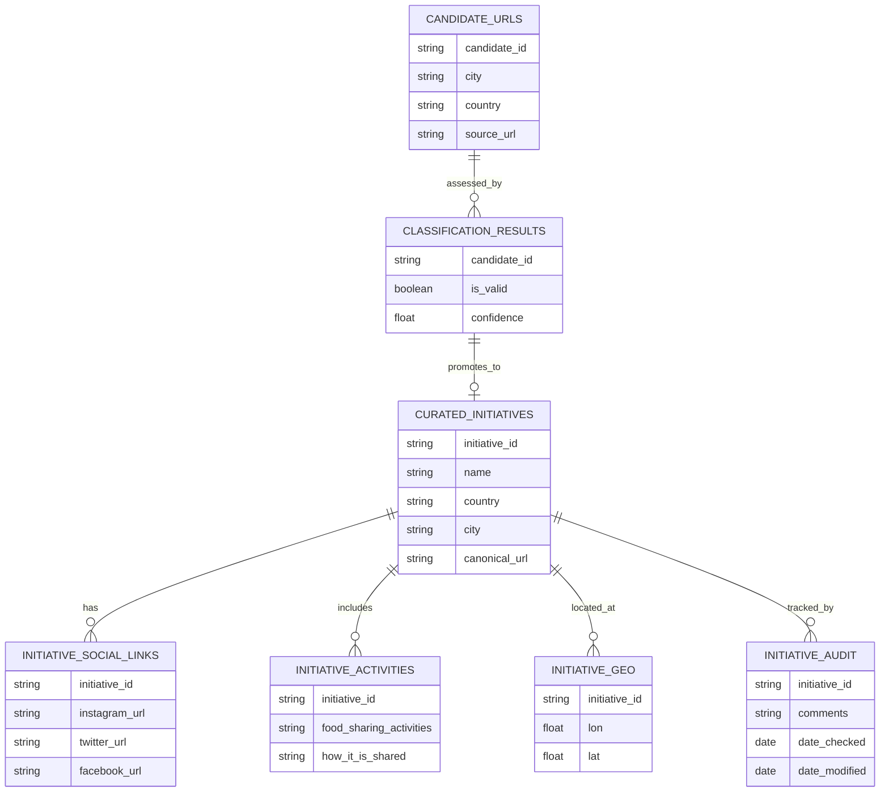

# Data model

## 1. Automation output (public-safe data contract)

The automation tool discovers candidate URLs for each city and enriches them through
web scraping and LLM-based classification. The downstream pipeline
(Azure → Snowflake) treats these outputs as an **input data contract**.

This layer is **internal and transitional**: it supports classification and curation,
but is not exposed to end users.

---

### Entity: Candidate URL

Represents a discovered web source prior to validation.

- `candidate_id` (STRING; generated)
- `city` (STRING)
- `country` (STRING; optional)
- `source_url` (STRING)
- `discovered_at` (TIMESTAMP)
- `query_phrase` (STRING; optional)
- `query_method` (ENUM: `dictionary` | `okapi` | `yake` | `llm`; optional)
- `is_blacklisted` (BOOLEAN)
- `blacklist_reason` (STRING; optional)

---

### Entity: Scraped content

Stores raw textual material used for classification.

- `candidate_id` (STRING; FK → Candidate URL)
- `page_url` (STRING)
- `about_url` (STRING; optional)
- `scraped_at` (TIMESTAMP)
- `page_text` (STRING)
- `about_text` (STRING; optional)
- `language` (STRING; optional)
- `word_count` (INTEGER; optional)

---

### Entity: Classification result

Captures the output of LLM-based validation.

- `candidate_id` (STRING; FK → Candidate URL)
- `classified_at` (TIMESTAMP)
- `model_family` (STRING; public-safe label, e.g. _ChatGPT-4_, _LLaMA-2_)
- `label` (ENUM: `valid_fsi` | `invalid_fsi`)
- `confidence` (FLOAT; optional)
- `reject_reason` (STRING; optional)
- `category` (STRING; optional; coarse category label)

---

### Entity: Initiative (curated record)

Represents a validated initiative after manual review and consolidation.

- `initiative_id` (STRING; stable downstream ID)
- `city` (STRING)
- `country` (STRING)
- `name` (STRING; curated)
- `canonical_url` (STRING)
- `description` (STRING; optional)
- `categories` (STRING or ARRAY; optional)
- `last_seen_at` (TIMESTAMP)
- `status` (ENUM: `active` | `unknown` | `inactive`; optional)

---

## 2. Curated export (final, authoritative contract)

The **Food Sharing Map** operates on a **single flattened dataset**, with **one row per initiative**.
This dataset is used consistently for:

- analysis
- visualisation
- public delivery

It represents the **final output of the automation and curation pipeline** and serves as the
**authoritative downstream data contract**.

---

### Schema (columns and data types)

| Column                  | Type              | Notes                                                                  |
| ----------------------- | ----------------- | ---------------------------------------------------------------------- |
| Country                 | STRING            | ISO country name or standard label                                     |
| City                    | STRING            | City name as used in the pipeline                                      |
| Name                    | STRING            | Curated initiative name                                                |
| URL                     | STRING            | Canonical website or primary source URL                                |
| Instagram URL           | STRING (nullable) | Social link (optional)                                                 |
| Twitter URL             | STRING (nullable) | Social link (optional)                                                 |
| Facebook URL            | STRING (nullable) | Social link (optional)                                                 |
| Food Sharing Activities | STRING            | Activity labels (multi-value; delimiter defined in data documentation) |
| How it is Shared        | STRING            | Sharing modality / mode                                                |
| Lon                     | FLOAT (nullable)  | Longitude (WGS84)                                                      |
| Lat                     | FLOAT (nullable)  | Latitude (WGS84)                                                       |
| Comments                | STRING (nullable) | Manual notes and contextual remarks                                    |
| Date Checked            | DATE (nullable)   | Latest manual verification date                                        |
| Date Modified           | DATE (nullable)   | Last curation update date                                              |

---

### Design rationale

**Flat structure**  
A single-table export ensures simplicity, interoperability, and ease of reuse across tools and partners.

**Clear pipeline boundary**  
This dataset marks the transition from automated discovery and classification to interpretation and delivery.

**Public-safe by design**  
No raw scraped text, credentials, or sensitive partner data are included.

**Stable contract**  
Upstream changes (queries, prompts, classification logic) do not affect downstream consumers as long as this schema remains stable.

---

## 3. Conceptual internal model (non-exported)

The following diagram illustrates the **internal relational structure** used during
automation and curation.  
These tables are **not exposed** in the final export.



---

## 4. Snowflake Implementation (Medallion Architecture)

The production pipeline implements a **Bronze/Silver/Gold medallion architecture** in Snowflake, transforming raw data through staging layers into business-ready analytics marts.

### Architecture Overview

```
Bronze (Raw Ingestion) → Silver (Staging & Normalization) → Gold (Business Marts)
```

**Bronze Layer:**
- Raw data ingestion from Azure Blob Storage
- Minimal transformation, preserving source structure
- Tables: `raw_automation`, `raw_automation_reviewed`, `raw_ground_truth`, `raw_city_language`, `raw_manual_verification`, `bronze_sharecity200_raw`

**Silver Layer:**
- Data cleaning and normalization
- URL normalization as Master Data Management (MDM)
- Type conversions (STRING → BOOLEAN)
- Tables: `stg_automation`, `stg_automation_enhanced`, `stg_automation_review`, `stg_ground_truth`, `stg_ground_truth_enhanced`, `stg_manual_verification`

**Gold Layer:**
- Business-ready analytics marts
- Final deduplicated dataset: `gold_fsi_final` (3,052 FSIs)
- City-level aggregations, regional clusters, accuracy metrics
- Tables: `fsi_city_summary`, `fsi_cluster_analysis`, `fsi_activity_summary`, `fsi_deduplication_impact`, `accuracy_comparison`

### Entity Relationship Diagram

For the complete Snowflake data model with relationships and data quality tests:

- **Interactive ERD** (recommended): See [04_ERD.dbml](04_ERD.dbml) - Copy contents and paste into [https://dbdiagram.io](https://dbdiagram.io) for interactive visualization
- **Markdown ERD**: See [04_ERD.md](04_ERD.md) - Renders directly in GitHub/VSCode with Mermaid diagrams

The ERD documents:
- All Bronze/Silver/Gold tables with column definitions
- Primary keys and foreign key relationships
- Data quality tests (uniqueness, not null, accepted values, accepted ranges)
- URL normalization strategy for deduplication
- Regional cluster assignments

### Key Technical Features

**1. URL Normalization as MDM**
- Lowercase conversion, www/https removal
- Domain extraction for deduplication matching
- Implemented in `stg_automation_enhanced` and `stg_ground_truth_enhanced`

**2. Multi-Strategy Deduplication**
- Exact matching: Normalized country+city+name
- URL-based: Normalized URL comparison
- Fuzzy matching: 92% similarity threshold (Levenshtein distance)
- **Results**: 3,140 FSIs → 3,052 FSIs (88 duplicates removed, 2.8% dedup rate)

**3. Data Quality Testing**
- Comprehensive dbt tests at all layers
- Uniqueness, not null, relationships, accepted values, accepted ranges
- Total count validation: Bronze (3,140), Gold (3,052)

**4. Regional Cluster Analysis**
- Cities grouped into 4 regions: Southern, Western, Northern, Eastern Europe
- Enables comparative analysis across regions
- FSI density metrics (FSIs per 100k population)

### Data Flow

```
Azure Blob Storage
    ↓
Snowflake Bronze (raw_*)
    ↓
dbt Staging (stg_*)
    ├─ Normalization
    ├─ Type conversion
    └─ Deduplication
    ↓
Gold Layer (gold_fsi_final, fsi_*, mart_*)
    ├─ City summaries
    ├─ Regional clusters
    ├─ Activity breakdowns
    └─ Accuracy metrics
    ↓
Power BI Dashboard
```

For detailed implementation documentation, SQL scripts, and dbt models, see:
- Snowflake setup: `snowflake/` directory
- dbt models: `models/` directory
- dbt tests: `models/staging/schema.yml`, `models/marts/schema.yml`
- Testing guide: `models/README.md`
